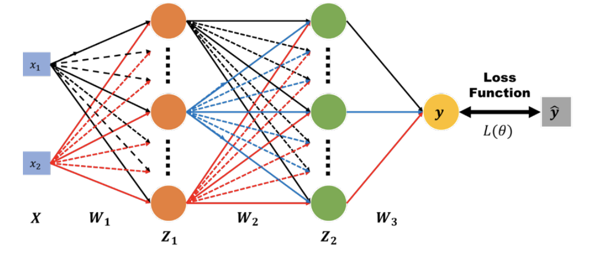

# SimpleNN-Implementation
In this implementation, I use NUMPY ot building a Simple Neural Network (NN)

#### Descriptions

(1) Notations:
*  : neural network inputs
*  : neural network outputs
*  : ground truth
*  : loss
*  : weight matrix of each network layers

(2) Activations Functions:
* linear, sigmoid, tanh, relu, softmax, leaky_relu, selu

(3) Optimizers
* SGDMomentum, SGDNesterovMomentum, Adagrad, RMSprop, Adam

### Simple Neural Network - py version

### Simple Neural Network - ipynb version

#### Current Structure of the codebase
- Toy Dataset Generation: gen_data (checkboard, mul_circle, spiral, moon, circle, blob)
- Activation Functions Class: AF (linear, sigmoid, tanh, relu, softmax, leaky_relu, selu)
- Loss Function Class: LF (We will only implement Softmax + Cross Entropy this time)
- The NN Model: SimpleNN (Defined a NN with list of neuron count and activation function)
- Optimizer Classes: Optimizer (SGD, SGDMomentum, SGDNesterovMomentum, Adagrad, RMSprop, Adam)
- Training Scheduler: StopScheduler (EarlyStopScheduler)
- Learning Rate Scheduler: LRScheduler (ReduceLROnPlateau)
- Utility Functions: grouper (Group data into mini-batches)
- Training Loop: train_model (The main function to train a model)
- Animation functions for the training process: draw_process, calculate_model_boundary, draw_model_boundary, draw_metrics_history
    - You can skip understanding these

#### Step 1
- Get an understanding of the Training Loop
    - We first call gen_data to get: class_cnt, training_data, validation_data, testing_data
    - We define our model structure and inital our SimpleNN model
    - We define our optimizer, lr_scheduler, stop_scheduler
    - We run through train_model with (model, optimizer, lr_scheduler, stop_scheduler, training_data, validation_data)
    - We can look at training process with draw_process
    - We evaluate our model through model.evaluate and look at accuracy and model boundary using draw_model_boundary

#### Step 2
- Understand the SimpleNN model
    - `__init__` will init the weights and biases
    - `empty_structure` will return an empty model will all weight and biases to be zero (Will be helpful later on)
    - `activation_func` and `loss_func` are wrappers functions to call the real functions
    - `forward` and `backprop` are the forward and backward pass of the neural net
        - `return_activations` in the forward pass is for usage in the backward pass
        - We return the delta of weight and biases for this x and y in `backprop`, this will be passed to the optimzer to decide the real delta
    - `update_one_batch_optimizer` is for getting the average delta to the model in the mini-batch
        - We will pass the delta to the optimizer and let it decide how it will change the weight and biases
    - `loss_one` and `loss` is for returning the loss
    - `evaluate_one` and `evaluate` is for returning the evaluation result

#### Step 3
- Make the `Basic Run` loop work by filling in some blanks
    - Implement forward/backward pass in SimpleNN
        - The forward and backward pass needs to be in vector form
    - Implement one of the Activation Functions (Eg. Relu)
        - The parameter d means derivative
    - Implement the Loss Function
        - We implement Softmax + Cross Entropy combined loss
    - Implement SGD to have one working optimizer
        - Naive SGD will just be to multiply the delta by the learning rate and update the weight and biases
    - Implement grouper function for making mini-batches

#### Step 4
- We shall be able to run through the `Basic Run` loop and see the training process happen!

#### Step 5
- Implment other Activation Functions
    - linear, sigmoid, tanh, relu, softmax, leaky_relu, selu
- Implement other Optimizers
    - SGDMomentum, SGDNesterovMomentum, Adagrad, RMSprop, Adam
- Implement other weights and biases initalization methods
    - Normalized Standard Normal
- Implment early stopping and learning rate decay
    - EarlyStopScheduler
    - ReduceLROnPlateau
    
#### Step Final
- Finish with the experiments detailed at the bottom
    - Try out different Toy Datasets
        - Must: "checkboard", "spiral", "mul_circle"
        - Others: "circle", "moon", "blob"
    - Try out different activation functions
        - Must: AF.linear, AF.sigmoid, AF.tanh, AF.relu
        - Others: AF.leaky_relu, AF.selu ...
    - Try out Different Optimizers
        - Must: SGD, SGD+Momentum, RMSprop, Adam
        - Others: SGD+NesterovMomentum, Adagrad
    - Try out different Gradient Descent Methods
        - Must: Batch, Stochastic, Mini-batch with different batch size
    - Try out different model structures (deep vs shallow / wide vs thin)
        - Must: (4)x1, (2)x4, (4)x2 - Others: (4)x3 ...
    - Try out other weights and biases initalization methods
    - Try out early stopping
    - Try out learning rate decay
